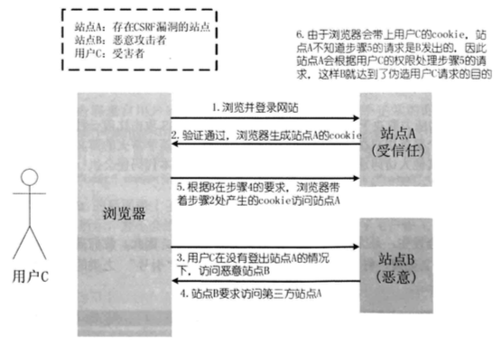

## 概念

 `CSRF`(**Corss Site Request Forgery**，跨站请求伪造)，简单的来说攻击者盗用了你的身份，以你的名义想第三方网站发送恶意的请求，攻击者利用你的身份发送邮件、短信、进行交易转账、甚至盗用你的账号扥造成个人隐私泄露和财产安全

 ## 原理

  一张图解释

 

 ## 危害

 ## 预防

  大部分需要服务端来解决

 - 尽量使用 `POST` 请求，限制 `GET`

 - 服务端将`cookie`设置为`httpOnly`

   ```
   response.setHeader("Set-Cookie","cookiename=cookievalue:HttpOnly");
   ```

 - 增加 `token`

   在`HTTP`请求中增加一个随机的`token`参数，使用服务端进行验证，如果请求中没有token或者token值不正确，则认为是CSRF攻击而拒绝请求

 - 验证 `HTTP Referer` 字段  

   `HTTP Referer`记录了请求这的来源地址，正常情况下请求一个安全受限的网页应该来自同一个网站，以此后端来验证 HTTP Referer值是否相同的域名，如果不是,则认为是CSRF攻击。

   

